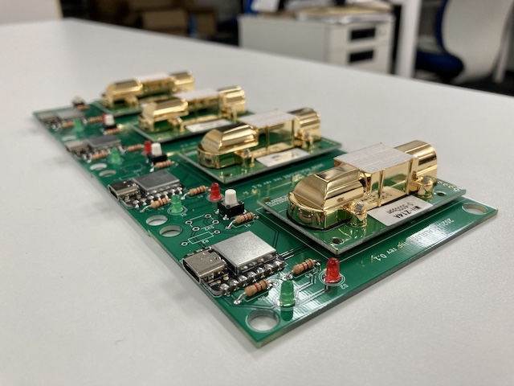

# usb_co2



Mac, LinuxマシンにUSBで接続できて追加ドライバ不要で値を読めるCO2センサ

## 使い方(macOS)

まず、USB機器をすべてコンピュータから取り外す。

次に、usb_co2をUSBポートに接続する。

次に、コンピュータに接続されているシリアルポートの一覧を表示する。

```
$ ls -1 /dev/cu.*
/dev/cu.Bluetooth-Incoming-Port
/dev/cu.iMiminashi5s-WirelessiAP
/dev/cu.usbmodem14101
```

上記の例の場合、`cu.usbmodem14101` というデバイスファイルがusb_co2を示す。

次に、`stty`コマンドを実行してシリアルポートの設定を行う。

```sh
stty -f /dev/cu.usbmodem14101 raw 9600
```

最後に、`cat`コマンドでデバイスファイルを読み込むとCO2の値(ppm)が表示される。

```
$ cat /dev/cu.usbmodem14101 
co2=399;status=0
co2=399;status=0
co2=399;status=0
co2=399;status=0
co2=399;status=0
co2=399;status=0
```

## 使い方(Linux)

まず、USB機器をすべてコンピュータから取り外す。

次に、usb_co2をUSBポートに接続する。

次に、コンピュータに接続されているシリアルポートの一覧を表示する。

```
$ ls -1 /dev/tty*
/dev/tty
.
. (中略)
.
/dev/ttyACM0
/dev/ttyAMA0
/dev/ttyprintk
/dev/ttyUSB0
```

上記の例の場合、`/dev/ttyACM0` というデバイスファイルがusb_co2を示す。

次に、`stty`コマンドを実行してシリアルポートの設定を行う。

```sh
stty -F /dev/ttyACM0 raw 9600
```

最後に、`cat`コマンドでデバイスファイルを読み込むとCO2の値(ppm)が表示される。

```
$ cat /dev/ttyACM0
co2=399;status=0
co2=399;status=0
co2=399;status=0
co2=399;status=0
co2=399;status=0
```
